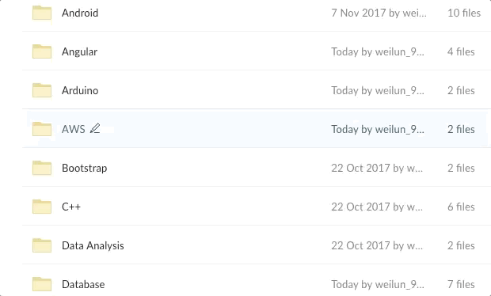

# Free Programming/Computer Books 
Free books to enchance technical skills. Updated regulaly.  

## Table of Content
  * [Hot Topics](#hot-topics)
  * [Quick View](#quick-view)
  * [Quick Tips](#quick-tips)
    + [Discover books](#discover-books)
    + [Explanation of different series of Packt books](#explanation-of-different-series-of-packt-books)
    + [Example of different series of Packt books.](#example-of-different-series-of-packt-books)
  * [Download](#download)
  * [Kids Section](#kids-section)
  * [Contribution](#contribution)
  * [Credits](#credits)

<small><i><a href='http://ecotrust-canada.github.io/markdown-toc/'>Table of contents generated with markdown-toc</a></i></small>

## Hot Topics
>The related topics can be found on the folder stated. 
>>Books for game development with C++ can be found in "C++" folder. 

     
Blockchain

     
Game development

  	 

  		<ul>
  		<li>C++</li>
  		<li>iOS</li>
 	    <li>Unity</li>
		</ul>  
 	 

     
Machine Learning

  	 

  		<ul>
  		<li>.NET</li>
  		<li>Java</li>
 	    <li>Python</li>
 	    <li>R</li>
 	    <li>TensorFlow</li>
		</ul>  
 	 

    
Mobile Development

    

        <ul>
            <li>
                

                    
Native

                    

                        <ul>
                            <li>Java/Kotlin</li>
                            <li>Objective-C/Swift</li>
                        </ul>
                    

                

            </li>
            <li>

                    
Cross-platform

                    

                        <ul>
                            <li>React Native</li>
                            <li>Xamarin</li>
                        </ul>
                    

                
</li>
        </ul>
    

     
Software Testing

  	 

  		<ul>
  		<li>Kali Linux</li>
  		<li>Python</li>
		</ul>  
 	 

    
Web Development

    

        <ul>
            <li>Angular</li>
            <li>ASP.NET</li>
            <li>Bootstrap</li>
            <li>Django</li>
            <li>Flux</li>
            <li>JavaScript</li>
            <li>Node.js</li>
            <li>PHP</li>
            <li>Python</li>
            <li>React</li>
            <li>Scrapy</li>
        </ul>
    

   
## Quick View

## Quick Tips
### Discover books
* Books that have [Packt](https://www.packtpub.com) logo, please search for "Who this book is for" section to know the targeted readers of the books.

### Explanation of different series of Packt books
  * Beginner's Guide
    * Anybody starting/beginning on a particular topic with some practical examples can pick a Beginner's Guide, to learn right from scratch.
  * Learning
    * A step-by-step guide. 
    * Anybody who has some light-hearted know-how but wants to learn a topic thoroughly can pick up a Learning book.
  * By Example
    * Anybody who wants to start with building a project on a topic can pick this up.
  * Cookbook
    * Anybody who knows the topic and wants to directly work with only practical examples and work through them can pick up    Cookbook. It has topics worked through in the form of a recipe with steps mentioned to go through the entire recipe process for a topic.
  * Essentials
    * Fast paced, highly concentrated information.
    * Anybody who wants to know key essentials/key things about a topic quickly can pick up an Essentials book.
  * Blueprints
    * If a person knows the topic and has decent experience building small projects can pick this up to building use-case projects.
  * Mastering
    * Anybody who is well-versed with the topic and now wants to master the topic to know the industry-level or highest possible level understanding/deployment of the topic can pick up a Mastering book.
  
### Example of different series of Packt books.
- [x] Kali Linux Wireless Penetration Testing **Beginner's Guide**
- [x] **Learning** Python
- [x] Android 5 Programming **by Example**
- [x] Web Development with Django **Cookbook**
- [x] Java Deep Learning **Essentials**
- [x] Xamarin **Blueprints**
- [x] **Mastering** .NET Maching Learning

[Packt](https://www.packtpub.com) series explanation can be found [here](https://prezi.com/6rhnqbkomjtr/the-different-series-of-packt-books).
  
## Download 
:link: Click [here](https://goo.gl/zTVKNu) to preview and :arrow_down: free books! :books:
* **Please only download the books that you needed as the whole folder is more than 3 GB**

## Kids Section
:link: Click [here](https://goo.gl/f8D7BV) for kids section

## Contribution 
:bulb: Kindly drop me an :email: - weilun_95@hotmail.com if you have any reference books to contribute.

## Credits
:link: Most of the books were taken from [here](https://www.packtpub.com/packt/offers/free-learning)
