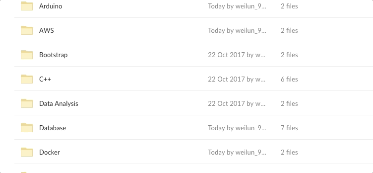

# Free Programming/Computer Books 
> Free books to enchance technical skills. Updated daily 

## Hot Topics :fire:
- [x] **Game development**
   * C++
   * iOS
   * Unity
- [x] **Machine Learning**
   * .NET
   * Java
   * Python
   * R
   * TensorFlow
- [x] **Mobile Development**
   * *Native*
     * Java
     * Swift/Objective-C
   * *Cross-platform*
     * React Native
     * Xamarin
- [x] **Web Development**
   * Angular
   * Bootstrap
   * Django
   * Flux
   * JavaScript
   * PHP
   * Python
   * React
   

## Quick View :mag_right:

## Download :arrow_down:
:link: Click [here](https://app.box.com/v/free-programming-books) to preview and download free books! :books:

## Kids Section
:link: Click [here](https://app.box.com/s/dssd6sw6ogtqz8ikjjo9horg4bqyxuet) for kids section

## Contribution :bulb:
Kindly drop me an :email: - weilun_95@hotmail.com if you have any reference books to contribute.

## Credits
:link: Most of the books were taken from [here](https://www.packtpub.com/packt/offers/free-learning)
